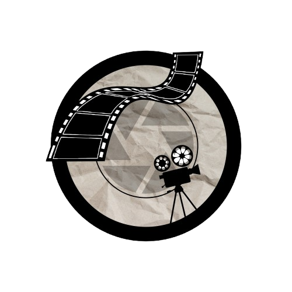
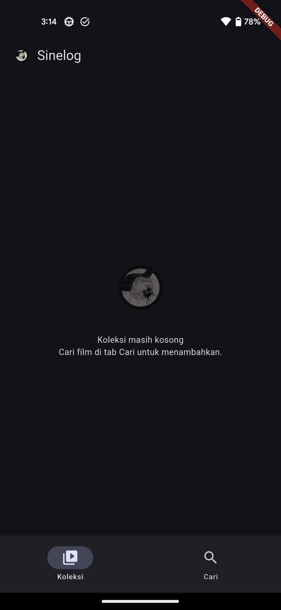
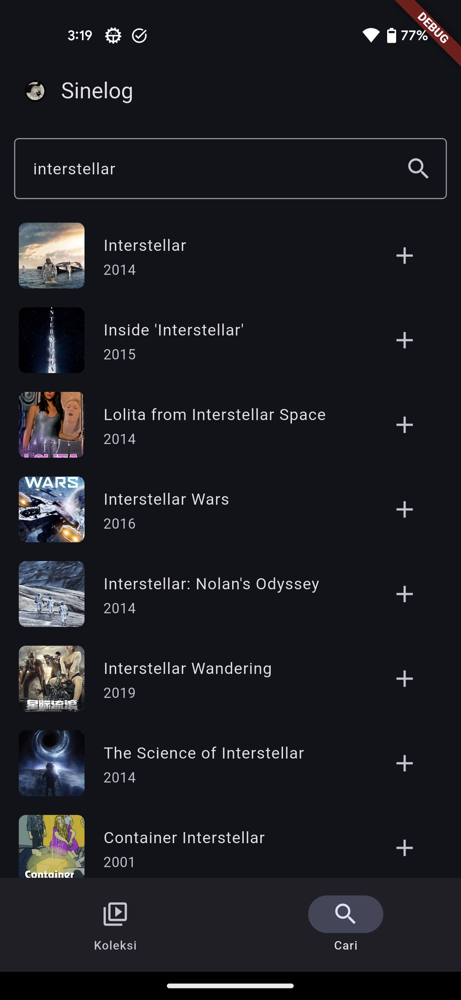
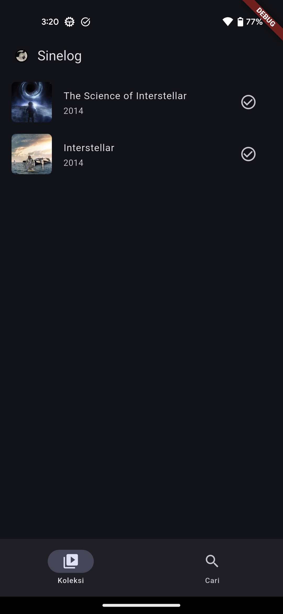
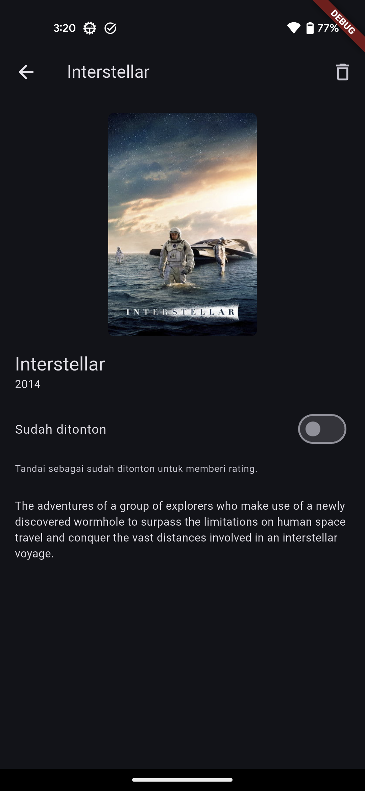
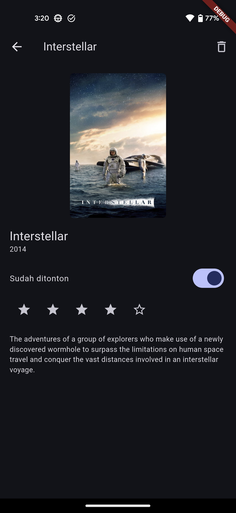
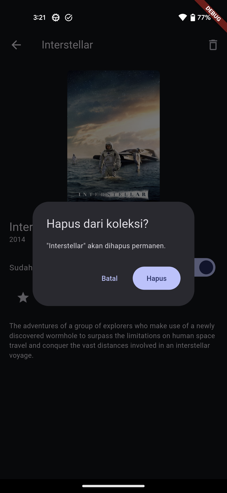

<div align="center">



# Sinelog

**Catat setiap film yang kamu tonton.**

Aplikasi Flutter untuk mencari film lewat TMDB, menyimpannya ke koleksi pribadi,
menandai mana yang sudah ditonton, dan memberi rating. Semuanya tersimpan offline di perangkat.

[](https://flutter.dev/)
[](https://dart.dev/)
[](https://pub.dev/packages/sqflite)
[](https://pub.dev/packages/provider)
[](https://developer.themoviedb.org/docs)

</div>

---

## Daftar Isi

- [Tentang Proyek](#tentang-proyek)
- [Fitur](#fitur)
- [Tangkapan Layar](#tangkapan-layar)
- [Tech Stack](#tech-stack)
- [Arsitektur](#arsitektur)
- [Memulai](#memulai)
- [Menjalankan Aplikasi](#menjalankan-aplikasi)
- [Pengujian](#pengujian)
- [Struktur Proyek](#struktur-proyek)
- [Skema Database](#skema-database)
- [Dukungan Platform](#dukungan-platform)
- [Roadmap](#roadmap)
- [Lisensi & Atribusi](#lisensi--atribusi)

---

## Tentang Proyek

Sinelog adalah pencatat tontonan pribadi. Alih-alih mengandalkan daftar di catatan
atau spreadsheet, film dicari langsung dari katalog [TMDB](https://www.themoviedb.org/)
lengkap dengan poster, sinopsis, dan tahun rilis, lalu disimpan ke database lokal
di perangkat.

Koleksi tetap ada setelah aplikasi ditutup, dan seluruh data milik pengguna tidak
pernah dikirim ke server mana pun. TMDB hanya dihubungi saat mencari film.

## Fitur

| Fitur | Keterangan |
|---|---|
| **Cari film** | Pencarian judul ke katalog TMDB, hasil lengkap dengan poster dan tahun rilis |
| **Tambah ke koleksi** | Film masuk ke database lokal; film yang sudah ada ditolak agar tidak ganda |
| **Koleksi pribadi** | Daftar semua film tersimpan, dengan *empty state* saat masih kosong |
| **Tandai sudah ditonton** | Status ditonton/belum bisa diubah kapan saja dari halaman detail |
| **Rating 1-5 bintang** | Hanya aktif untuk film yang sudah ditonton; menekan bintang yang sama menghapus rating |
| **Hapus film** | Selalu lewat dialog konfirmasi agar tidak terhapus tidak sengaja |
| **Persisten & offline** | Koleksi bertahan setelah aplikasi ditutup paksa; membaca koleksi tidak butuh internet |
| **Tema terang & gelap** | Mengikuti tema sistem lewat Material 3 |

### Aturan bisnis

Tiga aturan dijaga di lapisan repository, bukan di UI, sehingga berlaku sama dari
layar mana pun dan bisa diuji tanpa menjalankan aplikasi:

1. Satu film TMDB hanya boleh ada satu kali di koleksi.
2. Rating hanya berlaku untuk film berstatus **sudah ditonton**.
3. Mengembalikan status ke **belum ditonton** otomatis menghapus ratingnya.

## Tangkapan Layar

<div align="center">

| Koleksi kosong | Hasil pencarian | Koleksi terisi |
|:---:|:---:|:---:|
|  |  |  |

| Detail (belum ditonton) | Ditonton + rating | Konfirmasi hapus |
|:---:|:---:|:---:|
|  |  |  |

</div>

> Tangkapan layar lengkap beserta keterangannya ada di [`assets/screenshots/`](assets/screenshots/README.md).

## Tech Stack

| Kategori | Teknologi | Peran |
|---|---|---|
| **Framework** | [Flutter](https://flutter.dev) 3.47 · [Dart](https://dart.dev) SDK ^3.13.3 | UI lintas platform dari satu basis kode |
| **Desain** | Material 3 (`ColorScheme.fromSeed`) | Tema terang/gelap konsisten |
| **State management** | [`provider`](https://pub.dev/packages/provider) ^6.1.5 | Injeksi dependensi + `ChangeNotifier` untuk state koleksi |
| **Database lokal** | [`sqflite`](https://pub.dev/packages/sqflite) ^2.4.2 · [`path`](https://pub.dev/packages/path) ^1.9.1 | Penyimpanan SQLite persisten di perangkat |
| **Database (web)** | [`sqflite_common_ffi_web`](https://pub.dev/packages/sqflite_common_ffi_web) ^1.1.1 | Backend SQLite berbasis WASM untuk target web |
| **Jaringan** | [`http`](https://pub.dev/packages/http) ^1.6.0 | Klien REST ke TMDB API v3 |
| **Gambar** | [`cached_network_image`](https://pub.dev/packages/cached_network_image) ^3.4.1 | Poster dimuat sekali lalu di-cache |
| **Sumber data** | [TMDB API v3](https://developer.themoviedb.org/docs) | Katalog film, poster, dan metadata |
| **Pengujian** | `flutter_test` | Unit test aturan bisnis + widget test |
| **Kualitas kode** | [`flutter_lints`](https://pub.dev/packages/flutter_lints) ^6.0.0 | Aturan lint resmi Flutter |
| **Ikon** | [`flutter_launcher_icons`](https://pub.dev/packages/flutter_launcher_icons) ^0.14.4 | Membangkitkan launcher icon semua platform |

## Arsitektur

Proyek memakai pemisahan lapisan ala *clean architecture* yang disederhanakan.
Aturannya satu arah: **UI → Repository → Datasource**. UI tidak pernah menyentuh
SQLite atau HTTP secara langsung.

```
┌──────────────────────────────────────────────────────┐
│  Presentation        screens.dart · main.dart        │
│                      RootTabs, CollectionTab,        │
│                      SearchTab, DetailScreen         │
└───────────────────────────┬──────────────────────────┘
                            │ context.watch / read
┌───────────────────────────▼──────────────────────────┐
│  State               movie_store.dart                │
│                      MovieStore (ChangeNotifier)     │
└───────────────────────────┬──────────────────────────┘
                            │ memanggil aksi
┌───────────────────────────▼──────────────────────────┐
│  Domain / Rules      movie_repository.dart           │
│                      aturan bisnis + Stream koleksi  │
└──────────┬─────────────────────────────┬─────────────┘
           │                             │
┌──────────▼─────────────┐   ┌───────────▼─────────────┐
│  Local                 │   │  Remote                 │
│  MovieLocalDatasource  │   │  TmdbApiService         │
│  └ SqfliteMovie...     │   │  └ TMDB API v3          │
└────────────────────────┘   └─────────────────────────┘
```

Keputusan desain yang perlu diketahui:

- **Koleksi disiarkan lewat `Stream`.** Repository memancarkan ulang seluruh koleksi
  setiap ada perubahan, jadi layar yang mendengarkan ikut ter-update tanpa harus
  saling memberi tahu.
- **`MovieLocalDatasource` adalah abstraksi.** Implementasi sqflite dipisah dari
  kontraknya agar repository bisa diuji memakai *fake* in-memory, tanpa database sungguhan.
- **Pesan error dirakit di `TmdbApiService`.** `TmdbException` sudah berisi teks siap
  tampil (koneksi putus, API key salah, dll.) sehingga tidak ditulis ulang di tiap layar.
- **API key masuk lewat `--dart-define`.** Kunci tidak pernah ditulis di dalam kode
  maupun ikut ter-commit.

## Memulai

### Prasyarat

- [Flutter SDK](https://docs.flutter.dev/get-started/install) **3.47** atau lebih baru (Dart ^3.13.3)
- Akun [TMDB](https://www.themoviedb.org/signup) untuk memperoleh API key gratis
- Android Studio / Xcode bila ingin menjalankan di emulator atau perangkat fisik

Pastikan *toolchain* sudah lengkap:

```bash
flutter doctor
```

### Instalasi

**1. Klon repositori**

```bash
git clone <url-repositori> sinelog
cd sinelog
```

**2. Pasang dependensi**

```bash
flutter pub get
```

**3. Siapkan API key TMDB**

Ambil API key di **TMDB → Settings → API**, lalu buat berkas
`tmdb.local.properties` di akar proyek:

```properties
TMDB_API_KEY=isi_api_key_kamu_di_sini
```

Berkas ini sudah terdaftar di `.gitignore` dan **tidak boleh** ikut di-commit.
Tanpa berkas ini aplikasi tetap berjalan, tetapi pencarian akan menampilkan
pesan *"API key TMDB belum diisi"*.

## Menjalankan Aplikasi

Gunakan skrip `run.sh`, yang otomatis menyuntikkan API key dari
`tmdb.local.properties`:

```bash
./run.sh                # pilih device otomatis bila hanya ada satu
./run.sh -d <deviceId>  # tentukan device tertentu
```

Daftar device yang tersedia:

```bash
flutter devices
```

<details>
<summary>Menjalankan tanpa <code>run.sh</code></summary>

`run.sh` hanyalah pembungkus tipis. Perintah setaranya:

```bash
flutter run --dart-define-from-file=tmdb.local.properties
```

Atau dengan kunci langsung di baris perintah:

```bash
flutter run --dart-define=TMDB_API_KEY=isi_api_key_kamu
```

</details>

### Build rilis

```bash
flutter build apk    --release --dart-define-from-file=tmdb.local.properties
flutter build appbundle --release --dart-define-from-file=tmdb.local.properties
flutter build web    --release --dart-define-from-file=tmdb.local.properties
```

## Pengujian

```bash
flutter test              # jalankan seluruh test
flutter test --coverage   # sekaligus hasilkan laporan coverage
flutter analyze           # analisis statis sesuai flutter_lints
```

Cakupan pengujian saat ini:

- **`test/movie_repository_test.dart`**: tujuh unit test untuk aturan bisnis:
  penolakan duplikat, rating yang terkunci selama film belum ditonton, rating yang
  tereset saat status dikembalikan, independensi antar film, penghapusan, dan
  pemancaran ulang stream koleksi.
- **`test/widget_test.dart`**: memastikan aplikasi terpasang dan menampilkan
  *empty state* koleksi.
- **`test/fakes/fake_movie_datasource.dart`**: datasource in-memory sehingga unit
  test berjalan tanpa menyentuh sqflite.

## Struktur Proyek

```
lib/
├── main.dart                       # entry point, penyusunan provider, tema
├── screens.dart                    # seluruh layar: tab koleksi, cari, detail
├── movie_store.dart                # ChangeNotifier penghubung UI ↔ repository
├── models/
│   ├── movie.dart                  # entitas koleksi + (de)serialisasi baris DB
│   └── tmdb_dto.dart               # DTO respons TMDB (nullable sesuai API)
└── data/
    ├── movie_repository.dart       # aturan bisnis + stream koleksi
    ├── movie_local_datasource.dart # kontrak penyimpanan lokal
    ├── sqflite_movie_datasource.dart
    └── tmdb_api.dart               # klien TMDB + TmdbException

test/
├── movie_repository_test.dart
├── widget_test.dart
└── fakes/fake_movie_datasource.dart

assets/
├── images/logo.png                 # logo & sumber launcher icon
└── screenshots/                    # dokumentasi visual (tidak di-bundle ke app)
```

## Skema Database

SQLite lokal, berkas `sinelog.db`, skema versi 1:

```sql
CREATE TABLE movies(
  id            INTEGER PRIMARY KEY AUTOINCREMENT,
  tmdbId        INTEGER UNIQUE NOT NULL,   -- UNIQUE menjaga koleksi bebas duplikat
  title         TEXT NOT NULL,
  posterPath    TEXT,
  overview      TEXT NOT NULL,
  releaseDate   TEXT NOT NULL,
  watchedStatus TEXT NOT NULL DEFAULT 'unwatched',
  rating        INTEGER                    -- NULL bila belum diberi rating
);
```

Koleksi diurutkan `id DESC` sehingga film yang terakhir ditambahkan tampil paling atas.

## Dukungan Platform

| Platform | Status | Catatan |
|---|---|---|
| Android | Diuji | Target pengembangan utama (Pixel 4a, Android 13) |
| iOS | Terkonfigurasi | Proyek Runner & ikon siap, belum diuji di perangkat |
| Web | Terkonfigurasi | Memakai SQLite WASM lewat `sqflite_common_ffi_web` |
| Linux / macOS / Windows | Terkonfigurasi | Hasil `flutter create`, belum diuji |

## Roadmap

- [x] Fondasi proyek, logo, dan launcher icon
- [x] Model domain & DTO TMDB
- [x] Lapisan data: sqflite, klien TMDB, repository + pengujian
- [x] UI tersambung ke repository, koleksi persisten
- [ ] Filter koleksi berdasarkan status tonton
- [ ] Memecah `screens.dart` menjadi berkas per layar
- [ ] Memisahkan state menjadi `CollectionStore`, `SearchStore`, dan `DetailStore`

## Lisensi & Atribusi

Proyek ini dibuat untuk keperluan pembelajaran.

Data film disediakan oleh [The Movie Database (TMDB)](https://www.themoviedb.org/).
Produk ini memakai TMDB API, namun **tidak** didukung, disertifikasi, atau berafiliasi
dengan TMDB.
